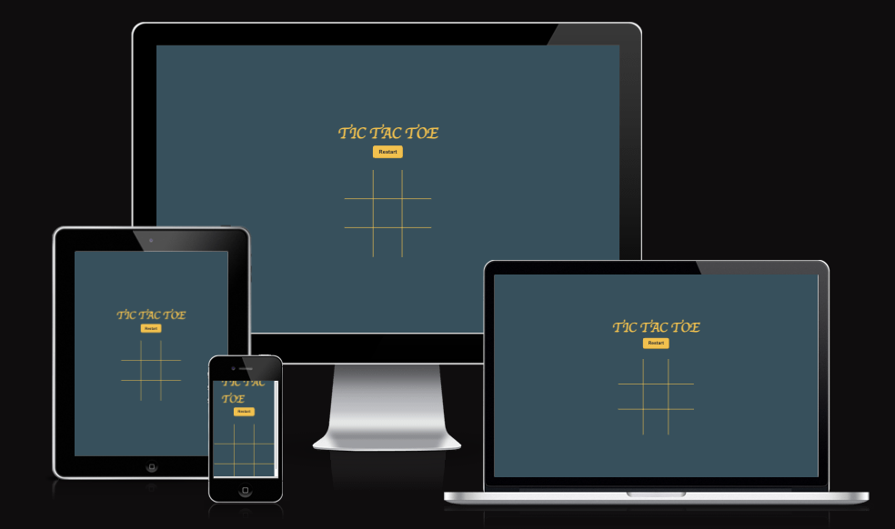
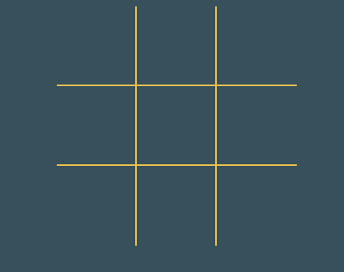

# TIC TAC TOE 

- Unleash Your Inner Tactician: A JavaScript Tic Tac Toe for Two!
Calling all Tic Tac Toe enthusiasts! Sharpen your pencils (or, rather, sharpen your clicking fingers) and prepare to battle it out with a friend in this classic game, brought to life with JavaScript.

### Existing Features

- __The TIC TAC TOE Heading__

 - The game title is displayed clearly on the page.

- __The Game Area__

  - This section will allow the user to play the  game. The user will be able to easily see the area to click on.
 

- __Restart Section__

  
  - The user will be able to restart the game just clicking the button restart 

### Features Left to Implement

- Adding the possibility to play against the AI

### Validator Testing 

- HTML
    - No errors were returned when passing through the official [W3C validator](https://validator.w3.org/nu/?doc=https%3A%2F%2Fandreasaggiomo.github.io%2FTic-Tac-Toe%2F)
- CSS
    - No errors were found when passing through the official [(Jigsaw) validator](https://jigsaw.w3.org/css-validator/validator?uri=https%3A%2F%2Fandreasaggiomo.github.io%2FTic-Tac-Toe%2F&profile=css3svg&usermedium=all&warning=1&vextwarning=&lang=it)
- JavaScript
    - No errors were found when passing through the official [Jshint validator](https://jshint.com/)
      - The following metrics were returned: 
      - There are 8 functions in this file.

- Number of Arguments:

Largest: 2 arguments (functions startGame and restart)
Median: 1 argument (functions boxClicked and playerHasWon)
Number of Statements:

Largest: 10 statements (function playerHasWon)
Median: 3 statements (functions startGame, restart, and anonymous functions)
Cyclomatic Complexity:

Most Complex: 4 (function playerHasWon)
Median: 2 (functions startGame, restart, boxClicked, and anonymous functions)

## Deployment

This section should describe the process you went through to deploy the project to a hosting platform (e.g. GitHub) 

- The site was deployed to GitHub pages. The steps to deploy are as follows: 
  - In the GitHub repository, navigate to the Settings tab 
  - From the source section drop-down menu, select the Master Branch
  - Once the master branch has been selected, the page will be automatically refreshed with a detailed ribbon display to indicate the successful deployment. 

The live link can be found here - https://andreasaggiomo.github.io/Tic-Tac-Toe/

## Credits 

- Credit for the love maths project and mixed content in the web 